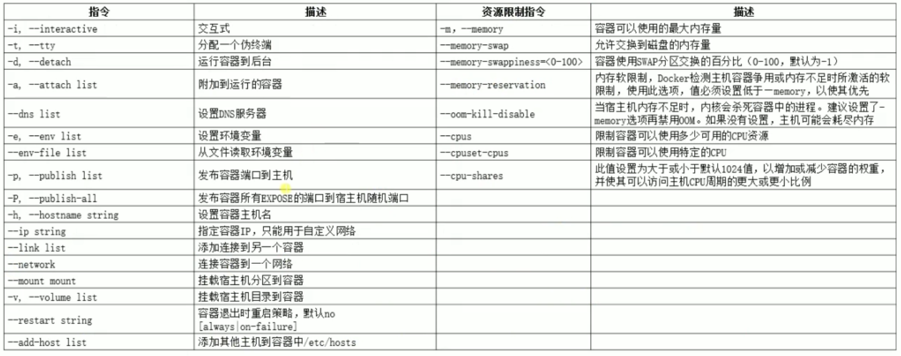
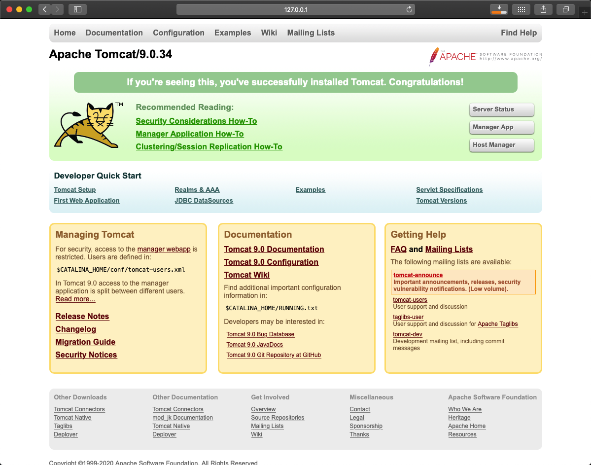
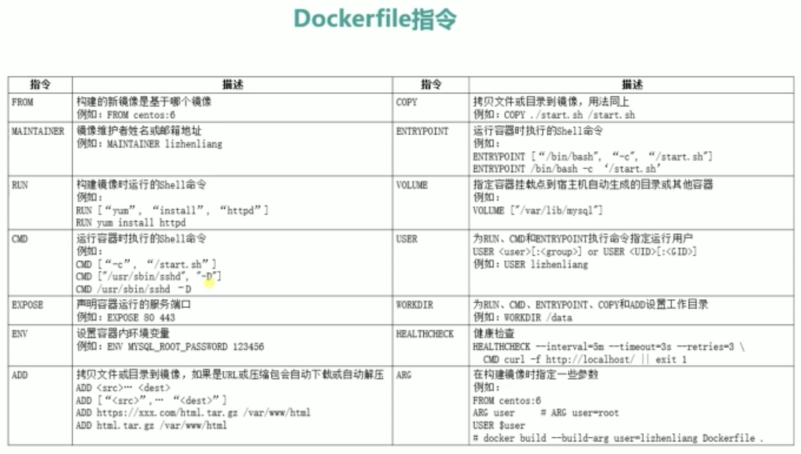
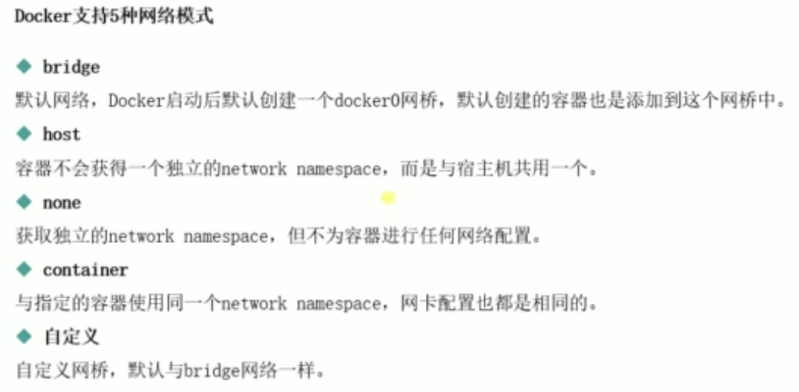
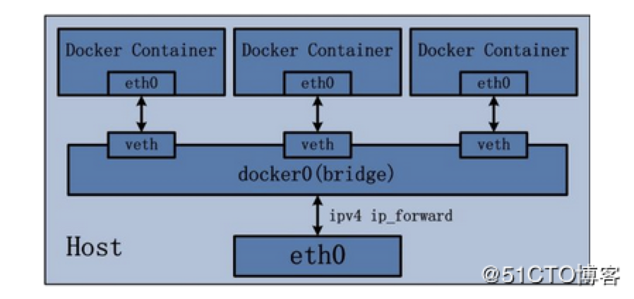
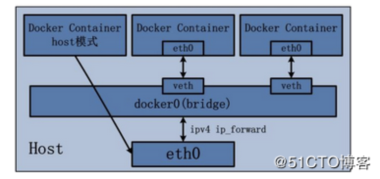
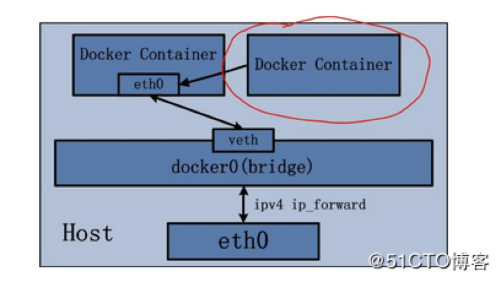

[TOC]


# CentOs7上安装docker

## 一、环境准备

Docker支持以下的CentOS版本，目前，CentOS 仅发行版本中的内核支持 Docker。

- Docker 运行在 CentOS 7 (64-bit)上，要求系统为64位、系统内核版本为 3.10 以上。
- Docker 运行在 CentOS-6.5 或更高的版本的 CentOS 上，要求系统为64位、系统内核版本为 2.6.32-431 或者更高版本。

先查看自己的系统版本,CentOS Linux release 7.4.1708 (Core)

> cat /etc/centos-release

查看系统内核版本是3.10.0-693.2.2.el7.x86_64

> uname -a

```bash
[root@creamk mysql]# cat /etc/centos-release
CentOS Linux release 7.7.1908 (Core)

[root@creamk mysql]# uname -a
Linux creamk.localdomain 3.10.0-693.el7.x86_64 #1 SMP Tue Aug 22 21:09:27 UTC 2017 x86_64 x86_64 x86_64 GNU/Linux
```

查看后满足docker的环境要求CentOS7.4+系统内核版本为 3.10 以上，就可以接下来的安装操作了

## 二、docker安装

新机器先安装必要的工具，比如：vim	wget	ssh服务等

```bash
sudo yum intstall -y wget vim ssh
```

配置ssh支持远程登录

```bash
# vim /etc/ssh/sshd_config
#  PermitRootLogin no  # no改为yes
保存退出
重启sshd服务
# systemctl restart sshd.service
```

配置yum源为国内源

```bash
# 备份yum源
mv /etc/yum.repos.d/CentOS-Base.repo /etc/yum.repos.d/CentOS-Base.repo.backup
# 从阿里获取yum源仓库
wget -o /etc/yum.repos.d/CentOS-Base.repo http://mirrors.aliyun.com/repo/Centos-7.repo
# 安装epel源
sudo yum install -y epel-release
# 配置epel源
wget -O /etc/yum.repos.d/epel-7.repo http://mirrors.aliyun.com/repo/epel-7.repo
# 清除缓存
sudo yum clean all
sudo yum makecache
sudo yum update
```

安装配置docker

```bash
# 配置docker源
sudo yum-config-manager  --add-repo   https://download.docker.com/linux/centos/docker-ce.repo
sudo yum-config-manager --enable docker-ce-nightly
sudo yum-config-manager --enable docker-ce-test
sudo yum-config-manager --disable docker-ce-nightly

# 安装docker服务依赖组件
sudo yum install -y yum-utils device-mapper-persistent-data lvm2

# 安装docker服务
sudo yum install -y docker-ce docker-ce-cli containerd.io

# 启动docker服务
sudo systemctl start docker
# 设置开机启动docker服务
sudo systemctl enable docker
```

安装完成后查看docker版本及服务是否正常启动

```bash
[root@creamk yum.repos.d]# docker ps -a
CONTAINER ID        IMAGE               COMMAND             CREATED             STATUS              PORTS               NAMES
[root@creamk yum.repos.d]# docker version
Client: Docker Engine - Community
 Version:           19.03.8
 API version:       1.40
 Go version:        go1.12.17
 Git commit:        afacb8b
 Built:             Wed Mar 11 01:27:04 2020
 OS/Arch:           linux/amd64
 Experimental:      false

Server: Docker Engine - Community
 Engine:
  Version:          19.03.8
  API version:      1.40 (minimum version 1.12)
  Go version:       go1.12.17
  Git commit:       afacb8b
  Built:            Wed Mar 11 01:25:42 2020
  OS/Arch:          linux/amd64
  Experimental:     false
 containerd:
  Version:          1.2.13
  GitCommit:        7ad184331fa3e55e52b890ea95e65ba581ae3429
 runc:
  Version:          1.0.0-rc10
  GitCommit:        dc9208a3303feef5b3839f4323d9beb36df0a9dd
 docker-init:
  Version:          0.18.0
  GitCommit:        fec3683
```


## 三、快速搭建centos7-python3.7环境

​	why：当我们在一台电脑上搭建了python3.6的环境，下次换了个电脑，或者换成linux的系统了，又得重新搭建一次，设置环境变量、下载pip等操作。
​	好不容易安装好，一会Scrips目录找不到pip.exe,一会提示pip不是内部或外部命令，一会又提示pip: command not found, 环境安装多了都是一把辛酸泪。

使用 docker search [内容] 命令从docker hub【https://hub.docker.com】中搜索指定的镜像

```bash
[root@creamk yum.repos.d]# docker search python
NAME                             DESCRIPTION                                     STARS               OFFICIAL            AUTOMATED
python                           Python is an interpreted, interactive, objec…   5125                [OK]
django                           Django is a free web application framework, …   952                 [OK]
pypy                             PyPy is a fast, compliant alternative implem…   238                 [OK]
kaggle/python                    Docker image for Python scripts run on Kaggle   139                                     [OK]
arm32v7/python                   Python is an interpreted, interactive, objec…   48
joyzoursky/python-chromedriver   Python with Chromedriver, for running automa…   47                                      [OK]
nikolaik/python-nodejs           Python with Node.js                             44                                      [OK]
centos/python-35-centos7         Platform for building and running Python 3.5…   38
circleci/python                  Python is an interpreted, interactive, objec…   38
centos/python-36-centos7         Platform for building and running Python 3.6…   29
arm64v8/python                   Python is an interpreted, interactive, objec…   21
centos/python-27-centos7         Platform for building and running Python 2.7…   17
bitnami/python                   Bitnami Python Docker Image                     6                                       [OK]
publicisworldwide/python-conda   Basic Python environments with Conda.           6                                       [OK]
dockershelf/python               Repository for docker images of Python. Test…   5                                       [OK]
clearlinux/python                Python programming interpreted language with…   4
i386/python                      Python is an interpreted, interactive, objec…   3
centos/python-34-centos7         Platform for building and running Python 3.4…   2
ppc64le/python                   Python is an interpreted, interactive, objec…   2
komand/python-plugin             DEPRECATED: Komand Python SDK                   2                                       [OK]
amd64/python                     Python is an interpreted, interactive, objec…   1
ccitest/python                   CircleCI test images for Python                 0                                       [OK]
openshift/python-33-centos7      DEPRECATED: A Centos7 based Python v3.3 imag…   0
s390x/python                     Python is an interpreted, interactive, objec…   0
saagie/python                    Repo for python jobs                            0
```

找到对应的镜像文件后，使用命令将镜像拉至本地

```bash
[root@creamk yum.repos.d]# docker pull centos/python-36-centos7
Using default tag: latest
latest: Pulling from centos/python-36-centos7
ab5ef0e58194: Pull complete
9a62185b9535: Pull complete
211f13f4e617: Pull complete
0ca27d7286e3: Pull complete
6916189c4090: Pull complete
0caec39576e7: Pull complete
0bfec924d389: Pull complete
e09f6bdd4907: Pull complete
d8b50a60e50f: Pull complete
Digest: sha256:011e0b8357e65042b3e46bc5e2e6ddde27c8a2082b6b2fcf0929834821f0dbea
Status: Downloaded newer image for centos/python-36-centos7:latest
docker.io/centos/python-36-centos7:latest
```

下载完成后，运行命令查看docker镜像

```bash
root@creamk yum.repos.d]# docker images
REPOSITORY                 TAG                 IMAGE ID            CREATED             SIZE
centos/python-36-centos7   latest              90c6a4022ee5        2 weeks ago         657MB
```


### 运行交互式的容器

```
$ sudo docker run [OPTIONS] IMAGE[:TAG] [COMMAND] [ARG…]
```

要启动centos7，进入交互模式，通过docker的两个参数 -i  -t  ，让docker运行的容器实现“对话”能力

- t : 在新容器内指定一个伪终端或终端
- i : 建立互动连接

```
docker run -it centos/python-36-centos7 /bin/bash 
```

这样可以进入容器中，执行相关的命令

```bash
[root@creamk yum.repos.d]# docker run -i -t centos/python-36-centos7 /bin/bash
(app-root) python
Python 3.6.9 (default, Nov 11 2019, 11:24:16)
[GCC 4.8.5 20150623 (Red Hat 4.8.5-39)] on linux
Type "help", "copyright", "credits" or "license" for more information.
>>> print("Hello, world")
Hello, world
>>> exit()
(app-root) exit
exit
[root@creamk yum.repos.d]# 
```


### 后台模式启动

run加上-i -t是进交互模式，如果不想进交互模式直接执行脚本，可以直接使用run,比如echo “hello world”,屏幕会输出”hello world”

> docker run centos/python-36-centos7 /bin/echo "Hello"

如果不想在前台执行，一般我们运行环境会选择挂后台,加个-d 参数即可

> docker run -d centos/python-36-centos7 /bin/echo "Hello"

```bash
[root@creamk doodle]# docker run centos/python-36-centos7 /bin/echo "Hello"
Hello
[root@creamk doodle]# docker run -d centos/python-36-centos7 /bin/echo "Hello"
40cd2b9e9a6f84157205b31cb58bff4a5751c9e4377dafcb7e0671b7c4982dbd
```

使用-d后台执行后，会发现下面多了一长串，这个就是容器的唯一id，可以通过这个id找到容器


### 容器的相关操作命令

使用docker ps查看正在运行的容器

> docker ps -a

```bash
[root@creamk doodle]# docker ps -a
CONTAINER ID        IMAGE                      COMMAND                  CREATED             STATUS                         PORTS               NAMES
40cd2b9e9a6f        centos/python-36-centos7   "container-entrypoin…"   5 seconds ago       Exited (0) 4 seconds ago                           confident_fermat
51a65872d0f9        centos/python-36-centos7   "container-entrypoin…"   42 seconds ago      Exited (0) 41 seconds ago                          suspicious_shockley
cc9142b333b0        centos/python-36-centos7   "container-entrypoin…"   About an hour ago   Exited (0) About an hour ago                       determined_bartik
c4acaf391ed5        training/webapp     "python app.py"     44 minutes ago      Up 44 minutes       0.0.0.0:5000->5000/tcp   peaceful_mendel
```

加-a参数,显示所有的容器，包括未运行的

ps 查找参数相关语法

- -a :显示所有的容器，包括未运行的。
- -f :根据条件过滤显示的内容。
- —format :指定返回值的模板文件。
- -l :显示最近创建的容器。
- -n :列出最近创建的n个容器。
- —no-trunc :不截断输出。
- -q :静默模式，只显示容器编号。
- -s :显示总的文件大小。


### logs查看日志

可以通过容器id去查运行的日志

> docker logs [容器id]

```bash
[root@creamk docker]# docker logs c4acaf391ed5
 * Running on http://0.0.0.0:5000/ (Press CTRL+C to quit)
```

也可以通过容器的名称去查看。容器名称是系统自动分配的，如上面的最后一项NAMES 值peaceful_mendel

```bash
[root@creamk docker]# docker logs peaceful_mendel
 * Running on http://0.0.0.0:5000/ (Press CTRL+C to quit)
```

-f: 让 docker logs 像使用 tail -f 一样来输出容器内部的标准输出。

> docker logs -f c4acaf391ed5


### 停止容器

可以用ps查看正在运行的容器

> docker ps

```bash
[root@creamk docker]# docker ps
CONTAINER ID        IMAGE               COMMAND             CREATED             STATUS              PORTS                    NAMES
c4acaf391ed5        training/webapp     "python app.py"     About an hour ago   Up About an hour    0.0.0.0:5000->5000/tcp   peaceful_mendel
```

停止容器的话，可以用stop容器的id

> docker stop c4acaf391ed5

或者提供容器名称peaceful_mendel来停止

> docker stop peaceful_mendel


### 启动容器

提供start启动容器

```bash
[root@creamk docker]# docker start c4acaf391ed5
c4acaf391ed5
[root@creamk docker]# docker ps -a
CONTAINER ID        IMAGE               COMMAND             CREATED             STATUS              PORTS                    NAMES
c4acaf391ed5        training/webapp     "python app.py"     About an hour ago   Up 3 seconds        0.0.0.0:5000->5000/tcp   peaceful_mendel
```

正在运行的容器，可以使用 docker restart 命令来重启

```bash
[root@creamk docker]# docker restart c4acaf391ed5
c4acaf391ed5
```


### 删除容器

使用 docker rm 命令来删除不需要的容器

```bash
[root@creamk doodle]# docker ps -a
CONTAINER ID        IMAGE                      COMMAND                  CREATED             STATUS                         PORTS               NAMES
40cd2b9e9a6f        centos/python-36-centos7   "container-entrypoin…"   5 seconds ago       Exited (0) 4 seconds ago                           confident_fermat
51a65872d0f9        centos/python-36-centos7   "container-entrypoin…"   42 seconds ago      Exited (0) 41 seconds ago                          suspicious_shockley
cc9142b333b0        centos/python-36-centos7   "container-entrypoin…"   About an hour ago   Exited (0) About an hour ago                       determined_bartik
[root@creamk doodle]# docker rm 40cd2b9e9a6f 51a65872d0f9 cc9142b333b0
40cd2b9e9a6f
51a65872d0f9
cc9142b333b0
```

但是rm 正在运行的容器时候，它会报错，需先stop，才能rm


### 导出镜像

导出镜像文件，使用docker save -o [/your/path/imgae.tar] [image-name:tag]

```bash
[root@creamk doodle]# docker images
REPOSITORY                 TAG                 IMAGE ID            CREATED             SIZE
mysql                      5.7                 5d9483f9a7b2        16 hours ago        455MB
centos/python-36-centos7   latest              90c6a4022ee5        2 weeks ago         657MB
golang                     1.11-alpine         e116d2efa2ab        8 months ago        312MB
training/webapp            latest              6fae60ef3446        4 years ago         349MB
[root@creamk doodle]# docker save -o /home/docker/doodle/mysql5.7.tar mysql:5.7
[root@creamk doodle]# ls
birthday2019  cheers2019  halloween2019  mysql5.7.tar  README.md  summer2019
```


### 删除镜像

删除镜像文件，使用docker rmi [镜像名:TAG / 镜像ID]

```bash
[root@creamk doodle]# docker rmi mysql:5.7
Untagged: mysql:5.7
Untagged: mysql@sha256:95b4bc7c1b111906fdb7a39cd990dd99f21c594722735d059769b80312eb57a7
Deleted: sha256:5d9483f9a7b21c87e0f5b9776c3e06567603c28c0062013eda127c968175f5e8
Deleted: sha256:6e9a8dddf039fbb90d3f80acd426eaca7604879399110d55ea731c7e0d49dac3
Deleted: sha256:fca6544c7e6840a421a07cd2cd9aa24263f32a49c03898b4adc78dc4d4b2a773
Deleted: sha256:38f7de84f809a3c6beb209f70f3cff6b81249ba028c35743188229f4e9047de7
Deleted: sha256:1c91814ddf810a764fa1815280c38b5bc3ff799d5e768d359ace9443df52a662
Deleted: sha256:af3a3fda5da43f7f03f8b3ca0330d120f9a7e5c0d9c5fc7b738ac45468a7de38
Deleted: sha256:86dceae8843638ef500e2a796a326ecb2ba1fd31cff817c4537afb67f04d6ff2
Deleted: sha256:2021ba03e116f319f5e8a90e3498d338ed213f1e036f59ffacc98266e7d3da6b
Deleted: sha256:3a3e1773b14d8b704f018b086292f46309cc27535f7484e0dfbf5a4308c81202
Deleted: sha256:372a8a077b4e29fa382990aeee3e38181481043fe145cb979ccd52588b4f36be
Deleted: sha256:821bf1f5688724dd59945682c34c0d33694af9c554cc1c3c69ca3aa9ba5d79ea
Deleted: sha256:c2adabaecedbda0af72b153c6499a0555f3a769d52370469d8f6bd6328af9b13
[root@creamk doodle]# docker images
REPOSITORY                 TAG                 IMAGE ID            CREATED             SIZE
centos/python-36-centos7   latest              90c6a4022ee5        2 weeks ago         657MB
golang                     1.11-alpine         e116d2efa2ab        8 months ago        312MB
training/webapp            latest              6fae60ef3446        4 years ago         349MB
[root@creamk doodle]#
```


### 导入镜像

导入镜像使用 docker load --input [image.tar]

```bash
[root@creamk doodle]# docker load --input mysql5.7.tar
c2adabaecedb: Loading layer [===============================================>]  72.49MB/72.49MB
49003fe88142: Loading layer [===============================================>]  338.4kB/338.4kB
8d3b3830445d: Loading layer [===============================================>]  9.539MB/9.539MB
49baacc63c3b: Loading layer [===============================================>]    4.2MB/4.2MB
24bd91e7be37: Loading layer [===============================================>]  1.536kB/1.536kB
d84f8cf1dc23: Loading layer [===============================================>]  53.75MB/53.75MB
ace74cb61ec0: Loading layer [===============================================>]  6.656kB/6.656kB
b95bdae56125: Loading layer [===============================================>]  3.584kB/3.584kB
d480fcc12a00: Loading layer [===============================================>]  320.2MB/320.2MB
83daf8b472c1: Loading layer [===============================================>]  16.38kB/16.38kB
bb45db375972: Loading layer [===============================================>]  1.536kB/1.536kB
Loaded image: mysql:5.7
[root@creamk doodle]# docker images
REPOSITORY                 TAG                 IMAGE ID            CREATED             SIZE
mysql                      5.7                 5d9483f9a7b2        16 hours ago        455MB
centos/python-36-centos7   latest              90c6a4022ee5        2 weeks ago         657MB
golang                     1.11-alpine         e116d2efa2ab        8 months ago        312MB
training/webapp            latest              6fae60ef3446        4 years ago         349MB
[root@creamk doodle]#
```





## 四、docker安装mysql环境

### 拉取镜像文件

首先可以通过docker search [name] 在hub.docker.com上搜索需要拉取的镜像名称

```
[root@creamk Python-3.7.0]# docker search mysql
NAME                              DESCRIPTION                                     STARS               OFFICIAL            AUTOMATED
mysql                             MySQL is a widely used, open-source relation…   9410                [OK]
mariadb                           MariaDB is a community-developed fork of MyS…   3391                [OK]
mysql/mysql-server                Optimized MySQL Server Docker images. Create…   688                                     [OK]
centos/mysql-57-centos7           MySQL 5.7 SQL database server                   74
mysql/mysql-cluster               Experimental MySQL Cluster Docker images. Cr…   66
centurylink/mysql                 Image containing mysql. Optimized to be link…   61                                      [OK]
deitch/mysql-backup               REPLACED! Please use http://hub.docker.com/r…   41                                      [OK]
bitnami/mysql                     Bitnami MySQL Docker Image                      39                                      [OK]
tutum/mysql                       Base docker image to run a MySQL database se…   34
schickling/mysql-backup-s3        Backup MySQL to S3 (supports periodic backup…   29                                      [OK]
```

使用 docker pull mysql来拉去mysql镜像，可以添加tag标签来拉取对应的版本（版本可在https://hub.docker.com上查看）

```bash
[root@creamk doodle]# docker pull mysql:5.7
5.7: Pulling from library/mysql
54fec2fa59d0: Pull complete
bcc6c6145912: Pull complete
951c3d959c9d: Pull complete
05de4d0e206e: Pull complete
319f0394ef42: Pull complete
d9185034607b: Pull complete
013a9c64dadc: Pull complete
58b7b840ebff: Pull complete
9b85c0abc43d: Pull complete
bdf022f63e85: Pull complete
35f7f707ce83: Pull complete
Digest: sha256:95b4bc7c1b111906fdb7a39cd990dd99f21c594722735d059769b80312eb57a7
Status: Downloaded newer image for mysql:5.7
docker.io/library/mysql:5.7
[root@creamk doodle]# docker images
REPOSITORY                 TAG                 IMAGE ID            CREATED             SIZE
mysql                      5.7                 5d9483f9a7b2        14 hours ago        455MB
centos/python-36-centos7   latest              90c6a4022ee5        2 weeks ago         657MB
golang                     1.11-alpine         e116d2efa2ab        8 months ago        312MB
training/webapp            latest              6fae60ef3446        4 years ago         349MB
```


### 配置Mysql

创建mysql目录，存放mysql相关的配置及数据

```bash
mkdir -p /home/mysql/conf /home/mysql/data /home/mysql/logs
```

创建完成，进入路径查看文件夹是否创建成功

```bash
[root@creamk ~]# cd /home/mysql/
[root@creamk mysql]# ll
总用量 0
drwxr-xr-x. 2 root root 6 4月  24 04:49 conf
drwxr-xr-x. 2 root root 6 4月  24 04:49 data
drwxr-xr-x. 2 root root 6 4月  24 04:49 logs
[root@creamk mysql]#
```


### 运行Mysql容器

运行命令如下：

```bash
docker run -p 3309:3306 —-name mysql5.7 -v /home/mysql/conf:/etc/mysql/conf.d -v /home/mysql/logs:/logs -v /home/mysql/data:/var/lib/mysql -e MYSQL_ROOT_PASSWORD=6862439 -d mysql:5.7
```

命令说明：

```bash
-—name  重命名mysql5.7

-p 3306:3306：[主机端口:容器端口]

  将容器的 3306 端口映射到主机的 3306 端口。

-v /home/mysql/conf:/etc/mysql/conf.d：

  将主机 /home/mysql/conf 挂载到容器的 /etc/mysql/my.cnf。

-v /home/mysql/logs:/logs：

  将主机 /home/mysql 目录挂载到容器的 /logs。

-v /home/mysql/data:/var/lib/mysql ：

  将主机 /home/mysql/data目录挂载到容器的 /var/lib/mysql 。

-e MYSQL_ROOT_PASSWORD=6862439：

  初始化 root 用户的密码。

-d 挂后台运行
```

创建mysql_run.sh，将运行命令写入其中

```bash
#!/bin/bash
docker run -p 3309:3306 —name mysql5.7 -v /home/mysql/conf:/etc/mysql/conf.d -v /home/mysql/logs:/logs -v /home/mysql/data:/var/lib/mysql -e MYSQL_ROOT_PASSWORD=6862439 -d mysql:5.7
```

保存退出后，修改脚本权限

```bash
[root@creamk mysql]# chmod 755 mysql_run.sh
[root@creamk mysql]# ll
总用量 4
drwxr-xr-x. 2 root root   6 4月  24 04:49 conf
drwxr-xr-x. 2 root root   6 4月  24 04:49 data
drwxr-xr-x. 2 root root   6 4月  24 04:49 logs
-rwxr-xr-x. 1 root root 196 4月  24 04:58 mysql_run.sh
```

运行脚本，使用docker ps -a 查看是否正常启动docker

```bash
[root@creamk mysql]# ./mysql_run.sh
0f3517c2400d35897a48383572658b4f31ea6dced8e39e5f1cb6e3e39d847f8d
[root@creamk mysql]# docker ps -a
CONTAINER ID        IMAGE               COMMAND                  CREATED             STATUS                       PORTS                               NAMES
0f3517c2400d        mysql:5.7           "docker-entrypoint.s…"   4 seconds ago       Up 3 seconds                 0.0.0.0:3306->3306/tcp, 33060/tcp   wonderful_lamarr
c4acaf391ed5        training/webapp     "python app.py"          10 hours ago        Exited (137) 8 minutes ago                                       peaceful_mendel
```

查看 /home/mysql/data 目录有数据产生

```bash
[root@creamk mysql]# ls data/
auto.cnf         client-key.pem  ib_logfile1         private_key.pem  sys
ca-key.pem       ib_buffer_pool  ibtmp1              public_key.pem
ca.pem           ibdata1         mysql               server-cert.pem
client-cert.pem  ib_logfile0     performance_schema  server-key.pem
```


### 进入容器bash

使用命令 docker exec -it [容器名称] bash

或者使用命令 docker attach

```bash
[root@creamk mysql]# docker exec -it wonderful_lamarr bash
root@0f3517c2400d:/# mysql -uroot -p
Enter password:
Welcome to the MySQL monitor.  Commands end with ; or \g.
Your MySQL connection id is 4
Server version: 5.7.29 MySQL Community Server (GPL)

Copyright (c) 2000, 2020, Oracle and/or its affiliates. All rights reserved.

Oracle is a registered trademark of Oracle Corporation and/or its
affiliates. Other names may be trademarks of their respective
owners.

Type 'help;' or '\h' for help. Type '\c' to clear the current input statement.

mysql>
```

之后可以在数据库中进行相关操作

在其他主机访问mysql数据库可通过客户端工具连接


## 五、docker部署tomcat及web服务

### 从https://hub.docker.com上拉取tomcat镜像

我这里拉取的是

```bash
[creamk@CreamK]# docker pull tomcat:jdk8-openjdk-slim
jdk8-openjdk-slim: Pulling from library/tomcat
54fec2fa59d0: Pull complete
b7dd01647a92: Pull complete
cb931af9b241: Pull complete
35b8cbae8041: Pull complete
4e00c79a1520: Pull complete
58d5430a6f83: Pull complete
4ea63b9970df: Pull complete
Digest: sha256:d4b2996a573e29b04d0f1dafb5be94f601e426b92002e0a6bed01b1562c86e8e
Status: Downloaded newer image for tomcat:jdk8-openjdk-slim
docker.io/library/tomcat:jdk8-openjdk-slim
[creamk@CreamK]# docker images
REPOSITORY            TAG                 IMAGE ID            CREATED             SIZE
jenkinsci/blueocean   latest              f3a41976424c        2 days ago          569MB
tomcat                jdk8-openjdk-slim   0e33b9ae84bb        3 days ago          304MB
```

### 运行容器

使用docker run 运行一个tomcat的容器

-   —name tomcat 容器重命名tomcat
-   -p 8088:8080  容器的8080端口映射到主机的8088端口
-   -v /Users/CreamK/StudyFIle/API/tomcat/webapps/tomcat_jdk8:/usr/local/tomcat/webapps 容器的/usr/local/tomcat/webapps 目录挂载到本机/Users/CreamK/StudyFIle/API/tomcat/webapps/tomcat_jdk8
-   -d 挂后台运行

>   docker run -p 8088:8080 -d --name tomcat -v /Users/CreamK/StudyFIle/API/tomcat/webapps/tomcat_jdk8:/usr/local/tomcat/webapps tomcat:jdk8-openjdk-slim

运行成功后 docker ps查看已运行容器

```bash
[creamk@CreamK]# docker run -p 8088:8080 -d --name tomcat -v /Users/CreamK/StudyFIle/API/tomcat/webapps/tomcat_jdk8:/usr/local/tomcat/webapps tomcat:jdk8-openjdk-slim
[creamk@CreamK]# docker ps -a
CONTAINER ID        IMAGE                      COMMAND                  CREATED             STATUS                        PORTS                                              NAMES
cdd925e21e25        tomcat:jdk8-openjdk-slim   "catalina.sh run"        4 minutes ago       Up 4 minutes                  0.0.0.0:8088->8080/tcp                             tomcat
084da0b8c76f        jenkinsci/blueocean        "/sbin/tini -- /usr/…"   32 hours ago        Exited (255) 27 minutes ago   0.0.0.0:8080->8080/tcp, 0.0.0.0:50000->50000/tcp   jenkins
[creamk@CreamK]#
```

镜像启动成功后，镜像中/usr/local/tomcat/webapps 下默认是空的目录，tomcat的主页在/usr/local/tomcat/webapps.dist目录下，需要进入容器中，把webapps.dist目录下内容拷贝进webapps下，重启docker

```bash
[creamk@CreamK]# docker exec -it tomcat bash
root@cb8e15aa23e4:/usr/local/tomcat# ls
BUILDING.txt  CONTRIBUTING.md  LICENSE	NOTICE	README.md  RELEASE-NOTES  RUNNING.txt  bin  conf  include  lib	logs  native-jni-lib  temp  webapps  webapps.dist  work
root@cb8e15aa23e4:/usr/local/tomcat# cd webapps/
root@cb8e15aa23e4:/usr/local/tomcat/webapps# mv ../webapps.dist/* .
root@cb8e15aa23e4:/usr/local/tomcat/webapps# exit
exit
[creamk@CreamK]# docker restart tomcat
```

如果用的是云服务器，需在后台开放8090端口，这样在浏览器输入http://主机ip:8090就能访问到tomcat首页了




### 部署war包

tomcat环境已经部署完成，接下来把war包放到tomcat下的webapps目录就可以了，

去下载jenkins的war包，http://updates.jenkins-ci.org/download/war/

下载完成后，将war包部署在容器的/usr/local/tomcat/webapps目录下

前面启动的时候，/usr/local/tomcat/webapps/jenkins目录是挂载到本机的~/yoyo/tomcat/webapps/jenkins目录。
只需下载jenkins.war放到jenkins目录就可以了

-   cd 到~/yoyo/tomcat/webapps/jenkins/目录
-   wget 下载jenkins.war
-   jar -xvf  解压jenkins.war

```
[root@yoyo jenkins]# cd ~/yoyo/tomcat/webapps/jenkins/
[root@yoyo jenkins]# wget http://mirrors.jenkins-ci.org/war/latest/jenkins.war
--2019-06-30 19:40:15--  http://mirrors.jenkins-ci.org/war/latest/jenkins.war
Resolving mirrors.jenkins-ci.org (mirrors.jenkins-ci.org)... 52.202.51.185
Connecting to mirrors.jenkins-ci.org (mirrors.jenkins-ci.org)|52.202.51.185|:80... connected.
HTTP request sent, awaiting response... 302 Found
Location: http://mirrors.tuna.tsinghua.edu.cn/jenkins/war/2.182/jenkins.war [following]
--2019-06-30 19:40:16--  http://mirrors.tuna.tsinghua.edu.cn/jenkins/war/2.182/jenkins.war
Resolving mirrors.tuna.tsinghua.edu.cn (mirrors.tuna.tsinghua.edu.cn)... 101.6.8.193, 2402:f000:1:408:8100::1
Connecting to mirrors.tuna.tsinghua.edu.cn (mirrors.tuna.tsinghua.edu.cn)|101.6.8.193|:80... connected.
HTTP request sent, awaiting response... 200 OK
Length: 77565765 (74M) [application/java-archive]
Saving to: ‘jenkins.war’

100%[=====================================================================================================================>] 77,565,765  12.1MB/s   in 5.1s

2019-06-30 19:40:22 (14.4 MB/s) - ‘jenkins.war’ saved [77565765/77565765]

[root@yoyo jenkins]# jar -xvf jenkins.war
```

解压之后的目录

```
[root@yoyo jenkins]# ll
total 78212
drwxr-xr-x  3 root root     4096 Jun 23 20:22 bootstrap
-rw-r--r--  1 root root     1946 Feb  7 12:49 ColorFormatter.class
drwxr-xr-x  5 root root     4096 Jun 23 20:22 css
-rw-r--r--  1 root root     1544 Jun 23 20:18 dc-license.txt
drwxr-xr-x  2 root root     4096 Jun 23 20:22 executable
-rw-r--r--  1 root root    17542 Jun 23 20:18 favicon.ico
drwxr-xr-x 12 root root     4096 Jun 23 20:22 help
drwxr-xr-x  6 root root     4096 Jun 23 20:22 images
-rw-r--r--  1 root root 77565765 Jun 24 11:22 jenkins.war
-rw-r--r--  1 root root     1674 Feb  7 12:49 JNLPMain.class
drwxr-xr-x  2 root root     4096 Jun 23 20:22 jsbundles
-rw-r--r--  1 root root      862 Feb  7 12:49 LogFileOutputStream$1.class
-rw-r--r--  1 root root      636 Feb  7 12:49 LogFileOutputStream$2.class
-rw-r--r--  1 root root     2240 Feb  7 12:49 LogFileOutputStream.class
-rw-r--r--  1 root root    20730 Feb  7 12:49 Main.class
-rw-r--r--  1 root root     1048 Feb  7 12:49 MainDialog$1$1.class
-rw-r--r--  1 root root     1067 Feb  7 12:49 MainDialog$1.class
-rw-r--r--  1 root root     2633 Feb  7 12:49 MainDialog.class
-rw-r--r--  1 root root      512 Feb  7 12:49 Main$FileAndDescription.class
drwxr-xr-x  3 root root     4096 Jun 30 19:22 META-INF
-rw-r--r--  1 root root       71 Jun 23 20:18 robots.txt
drwxr-xr-x  3 root root     4096 Jun 23 20:22 scripts
drwxr-xr-x  7 root root     4096 Jun 23 20:22 WEB-INF
-rw-r--r--  1 root root  2390099 May 12 15:50 winstone.jar
[root@yoyo jenkins]#
```

接着重启tomcat容器就可以生效了

>   docker restart yoyotomcat

### 访问jenkins

浏览器输入访问地址:http://主机ip:8090/jenkins就能访问到主页面了


### 方法二：不挂载运行容器

上面是通过挂载tomcat下的webapps目录，在本机上把war包放进去的方式。如果不挂载容器的目录，试了下也是可以把war包放进去的
一个tomca镜像可以启动多个容器实例，可以再启动一个yytomcat的容器实例,映射到主机的8091端口

```
[root@yoyo jenkins]# docker run --name yytomcat -p 8091:8080 -d tomcat
08af0192b961f1ba1bb1bf1edada968822f3143e5f57c59c396fd3fd948e7529
[root@yoyo jenkins]# docker   ps
CONTAINER ID        IMAGE               COMMAND                  CREATED             STATUS              PORTS                               NAMES
08af0192b961        tomcat              "catalina.sh run"        3 hours ago         Up 3 hours          0.0.0.0:8091->8080/tcp              yytomcat
1d07763a6eaa        tomcat              "catalina.sh run"        4 hours ago         Up 3 hours          0.0.0.0:8090->8080/tcp              yoyotomcat
643c1f7c970c        mysql:5.7           "docker-entrypoint.s…"   11 hours ago        Up 4 hours          33060/tcp, 0.0.0.0:3309->3306/tcp   yoyomysql
37a3b50d151c        mysql:5.6           "docker-entrypoint.s…"   28 hours ago        Up 4 hours          0.0.0.0:3308->3306/tcp              mymysql
[root@yoyo jenkins]#
```

启动完成后在浏览器输入http://主机ip:8091就可以访问到tomcat首页了，接着用docker cp 把本机的war包复制到yytomcat容器里面

接着前面下载jenkins.war并解压到~/yoyo/tomcat/webapps/jenkins/目录步骤

-   docker cp 复制 jenkins整个目录到 容器的/usr/local/tomcat/webapps/jenkins目录

-   docker exec -it yytomcat /bin/bash 进入运行容器的交互环境

-   cd 到tomcat容器的webapps/jenkins目录，查看到已经复制成功

-   exit 退出容器

-   docker restart 重启容器

    ```
    [root@yoyo ~]# docker cp ~/yoyo/tomcat/webapps/jenkins/ yytomcat:/usr/local/tomcat/webapps/jenkins
    [root@yoyo ~]# docker exec -it yytomcat /bin/bash
    root@08af0192b961:/usr/local/tomcat# cd webapps/jenkins
    root@08af0192b961:/usr/local/tomcat/webapps/jenkins# ls
    ColorFormatter.class         LogFileOutputStream.class        MainDialog$1$1.class  bootstrap      favicon.ico  jsbundles
    JNLPMain.class             META-INF                MainDialog$1.class      css          help           robots.txt
    LogFileOutputStream$1.class  Main$FileAndDescription.class  MainDialog.class      dc-license.txt  images       scripts
    LogFileOutputStream$2.class  Main.class                WEB-INF          executable      jenkins.war  winstone.jar
    root@08af0192b961:/usr/local/tomcat/webapps/jenkins#
    root@08af0192b961:/usr/local/tomcat/webapps/jenkins# exit
    exit
    [root@yoyo ~]# docker restart yytomcat
    yytomcat
    [root@yoyo ~]#
    ```

    浏览器输入访问地址:http://主机ip:8091/jenkins就能访问到主页面了


## 六、docker-compose容器集群编排

------

### 前言

实际工作中，我们部署一个应用，一般不仅仅只有一个容器，可能还会涉及到其他模块，比如：数据库、消息中间件MQ、web前端、后端服务等

如果一个一个去启动应用，很难记住，需要一个配置文件，实现对docker容器集群的快速编排


### docker-compose

------

简介

​	   Docker-Compose项目是Docker官方的开源项目，负责实现对Docker容器集群的快速编排。
Docker-Compose将所管理的容器分为三层，分别是工程（project），服务（service）以及容器（container）。
​	   Docker-Compose运行目录下的所有文件（docker-compose.yml，extends文件或环境变量文件等）组成一个工程，若无特殊指定工程名即为当前目录名。一个工程当中可包含多个服务，每个服务中定义了容器运行的镜像，参数，依赖。一个服务当中可包括多个容器实例，Docker-Compose并没有解决负载均衡的问题，因此需要借助其它工具实现服务发现及负载均衡。

​	   Docker-Compose的工程配置文件默认为docker-compose.yml，可通过环境变量COMPOSE_FILE或-f参数自定义配置文件，其定义了多个有依赖关系的服务及每个服务运行的容器。


### 安装

------

docker-compose使用pip安装即可

```bash
pip3 install docker-compose
```

安装完成后查看版本 docker-compose version

```bash
[root@creamk images]# docker-compose version
docker-compose version 1.25.5, build unknown
docker-py version: 4.2.0
CPython version: 3.7.0
OpenSSL version: OpenSSL 1.0.2k-fips  26 Jan 2017
```


### 实例

------


docker-compose.yml文件

---

docker-compose已经安装成功，接下来去https://hub.docker.com上找个项目部署来练习下，项目地址： https://hub.docker.com/r/easymock/easymock


七、Dockerfile构建镜像



```
# 基于python3.6.8镜像
FROM python:3.6.8

MAINTAINER creamk87  <creamk87@outlook.com>

# 更新pip
RUN pip install --upgrade pip 

# 工作目录
WORKDIR /code
ADD . /code

# pip安装依赖包
RUN pip install -r requirements.txt

# 传递参数
ENTRYPOINT ["pytest"]

# 默认显示help帮助信息
CMD ["--help"]
```

---




$$

$$


## 附录：

### QA：docker拉取镜像很慢怎么办

试着使用阿里云镜像加速器地址或国内镜像地址(只有流星的镜像，无私有镜像)，操作如下

```bash
root@creamk etc]# tee /etc/docker/daemon.json <<-'EOF'
>{
>"registry-mirrors": ["https://9cpn8tt6.mirror.aliyuncs.com"]
> 或者使用下面这句
> "registry-mirrors": ["https://registry.docker-cn.com"]
>}
>EOF
[root@creamk etc]# systemctl daemon-reload
[root@creamk etc]# systemctl restart docker
```


### QA:docker支持的5种网络模式



#### bridge网络：



#### host网络：



#### container网络：




### QA:docker主机数据挂载到容器上


